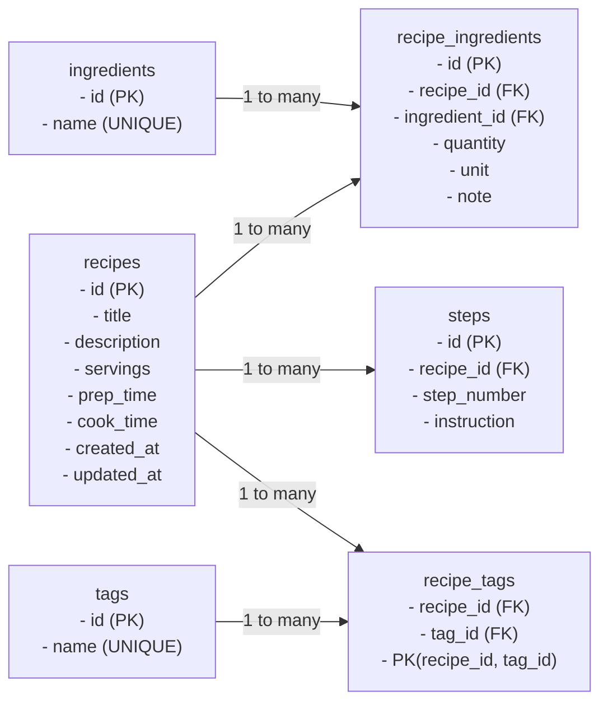

# Cafe Keeper

A comprehensive cafe management platform designed to streamline daily operations, organize shift tasks, recipe management, staff training, and inventory tracking—helping teams run efficiently and consistently.

## Getting Started

To start the application in development mode:

```bash
npm run dev
```

## Features

### Business Solutions for Growing Companies

#### Recipes & Menu

Simplify menu and recipe management—store recipes, track ingredients, and share updates with your team to keep every cup and dish consistent and high-quality.

- **Beverage recipes:** Standardized espresso shots, milk ratios, flavorings
- **Food recipes:** Pastries, sandwiches, seasonal specials
- **Ingredient quantities:** Portions per drink/plate
- **Menu versions:** Seasonal updates, special promotions

#### Equipment & Maintenance

Manage and maintain all your equipment with ease—track purchases, maintenance, images, and ownership history, all in one organized platform.

- **Machine schedules:** Espresso machines, grinders, ovens
- **Maintenance logs:** Cleaning, servicing, repairs
- **Supplies:** Filters, water softeners, cleaning chemicals
- **Roasting:** Procedures, beans, maintenance

#### Team Messaging

A simple team chat for scheduling and updates—send messages, request shift coverage, and get notifications in real time.

- **Real-time communication:** Instant team updates
- **Shift coverage requests:** Easy shift swapping
- **Scheduling coordination:** Centralized team communication

#### Shift & Staff Management

Manage staff details and track shift activities, notes, and instructions—all in one easy-to-use system.

- **Shift schedules:** Who's working when
- **Task assignments:** Barista duties, cleaning, restocking
- **Training & certifications:** Food handling, coffee brewing skills
- **Performance tracking:** Speed, accuracy, upselling, customer feedback

#### Vendor & Supply Management

Track vendors, orders, and supplies all in one place to keep your operations running smoothly.

- **Stock levels:** Coffee beans, milk, syrups, cups, lids, napkins
- **Suppliers:** Contact info, lead times, costs
- **Purchase orders & deliveries:** Automated restocking triggers
- **Waste tracking:** Expired or spoiled items

#### Barista and Roaster Training

Train your baristas and roasters with interactive lessons and quizzes, reinforcing key skills and company standards while tracking staff progress.

- **Interactive lessons:** Structured training modules
- **Progress tracking:** Monitor staff development
- **Skill reinforcement:** Quizzes and assessments
- **Company standards:** Consistent quality training

## Performance Metrics

- **+32% Operational Efficiency:** Streamlined processes reduce time on non-revenue activities
- **99.9% Staff Training Completion:** Comprehensive training programs ensure team readiness
- **2+ Advanced Training Programs:** Specialized skill development for baristas and roasters
- **24/7 Fresh Coffee Available:** Round-the-clock operational support

## Additional Features

### Customer Engagement

- **Loyalty programs:** Points, rewards, memberships
- **Order history:** Frequent items, preferences
- **Feedback tracking:** Complaints, compliments, suggestions
- **Special promotions:** Discounts, seasonal drinks

### Compliance & Safety

- **Health & safety logs:** Sanitation, cleaning schedules
- **Food safety checks:** Temperatures, allergen info
- **Regulatory compliance:** Licenses, inspections, certifications

### Reporting & Analytics

- **Sales trends:** Peak hours, best-selling items
- **Inventory turnover:** Popular vs. slow-moving items
- **Staff performance:** Efficiency, errors, training needs
- **Customer behavior:** Preferences, seasonal patterns

## Database

Recipe table relationship flowchart:


